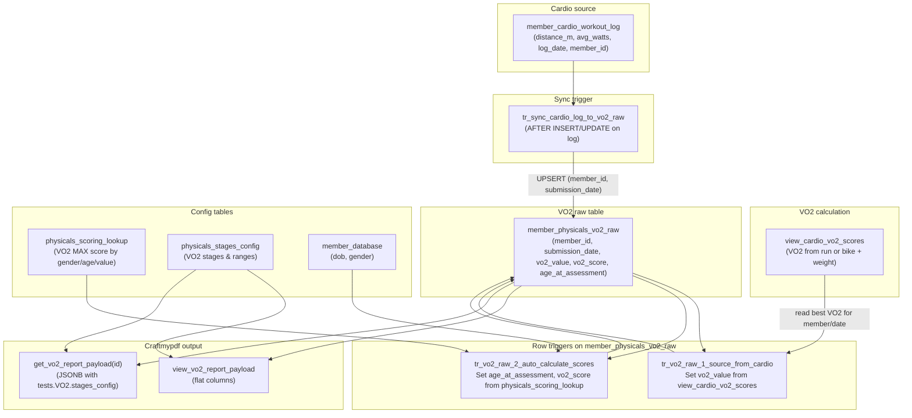
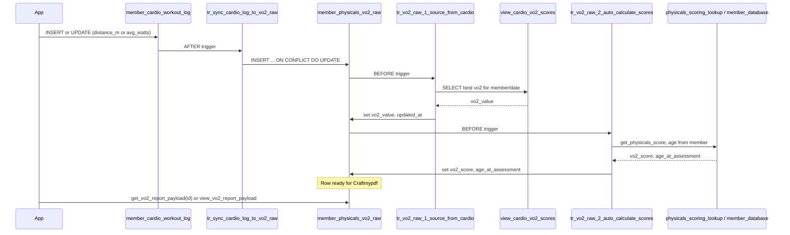

# VO2 Physicals & Craftmypdf Flow

Summary of the VO2-only physicals table, how it is fed from cardio data, and how the Craftmypdf payload is built.

---

## 1. Overview

- **`member_physicals_vo2_raw`** – Table that holds one row per member per date for VO2 reporting (Craftmypdf).
- **`view_cardio_vo2_scores`** – View that computes VO2 (ml/kg/min) from cardio workout logs (run distance or bike watts + weight).
- Whenever a cardio workout is logged, a row is upserted into `member_physicals_vo2_raw` for that member/date; VO2 value and score are filled from the view and config.

---

## 2. End-to-end process

1. **Cardio is logged**  
   A row is inserted or updated in **`member_cardio_workout_log`** (e.g. run distance or bike watts).

2. **Sync to VO2 raw**  
   Trigger **`tr_sync_cardio_log_to_vo2_raw`** runs on `member_cardio_workout_log`.  
   If the log can produce VO2 (`distance_m > 0` or `avg_watts > 0`), it **upserts** into **`member_physicals_vo2_raw`** for that `member_id` and `log_date` (as `submission_date`).

3. **VO2 value from cardio view**  
   Trigger **`tr_vo2_raw_1_source_from_cardio`** on `member_physicals_vo2_raw` runs.  
   It sets **`vo2_value`** from **`view_cardio_vo2_scores`** (best VO2 for that member on that date).  
   The view computes VO2 from run: `(distance_m - 504.9) / 44.73` or bike: `(10.8 * avg_watts / weight + 7) * mercy_multiplier`.

4. **Score and age**  
   Trigger **`tr_vo2_raw_2_auto_calculate_scores`** runs.  
   It sets **`age_at_assessment`** from `member_database.dob` and **`vo2_score`** via **`get_physicals_score('VO2 MAX', gender, age, vo2_value)`** using **`physicals_scoring_lookup`**.

5. **Craftmypdf payload**  
   - **View:** **`view_vo2_report_payload`** – one row per `member_physicals_vo2_raw` with flat columns (member, date, age_bracket, VO2 value/score/label, group average, difference, category styles, range strings, is_reset / is_baseline / is_longevity / is_performance).  
   - **Function:** **`get_vo2_report_payload(id)`** – returns the same data as a single JSONB (including `tests.VO2.stages_config` from **`physicals_stages_config`**).

---

## 3. Tables and config involved

| Object | Role |
|--------|------|
| `member_cardio_workout_log` | Source of run/bike data (distance_m, avg_watts, log_date, member_id). |
| `view_cardio_vo2_scores` | Computes VO2 value per log row (uses member_health_metrics weight, system_config for VO2 mercy_multiplier). |
| `member_physicals_vo2_raw` | One row per member per submission_date; vo2_value and vo2_score stored here. |
| `member_database` | Member info (dob, gender, name) for age and scoring. |
| `physicals_scoring_lookup` | Raw value → score for VO2 MAX by gender/age. |
| `physicals_stages_config` | VO2 stages (Reset, Baseline, Longevity, Performance) and ranges by gender/age_bracket for labels and Craftmypdf. |

---

## 4. Mermaid diagram

---

## 5. Sequence (high level)

---

## 6. Related SQL files (in this folder)

- **`supabase_member_physicals_vo2_raw.sql`** – Table, triggers on `member_physicals_vo2_raw`, `view_vo2_report_payload`, `get_vo2_report_payload(id)`.
- **`supabase_sync_cardio_to_vo2_raw.sql`** – Trigger on `member_cardio_workout_log` that upserts into `member_physicals_vo2_raw`.

---

## 7. Quick reference

| Action | How |
|--------|-----|
| New cardio log creates VO2 raw row | Automatic via `tr_sync_cardio_log_to_vo2_raw` on `member_cardio_workout_log`. |
| Get flat row for Craftmypdf | `SELECT * FROM view_vo2_report_payload WHERE id = ...` (or by member_id, submission_date). |
| Get JSON payload for Craftmypdf | `SELECT get_vo2_report_payload('uuid-here');` |
| Manually add a report row | `INSERT INTO member_physicals_vo2_raw (member_id, submission_date) VALUES (...);` – triggers will fill vo2_value from view and vo2_score from config. |
