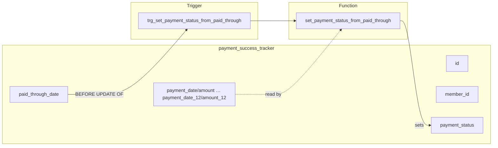
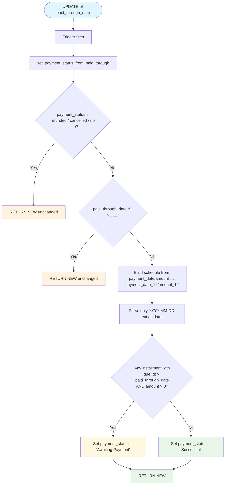
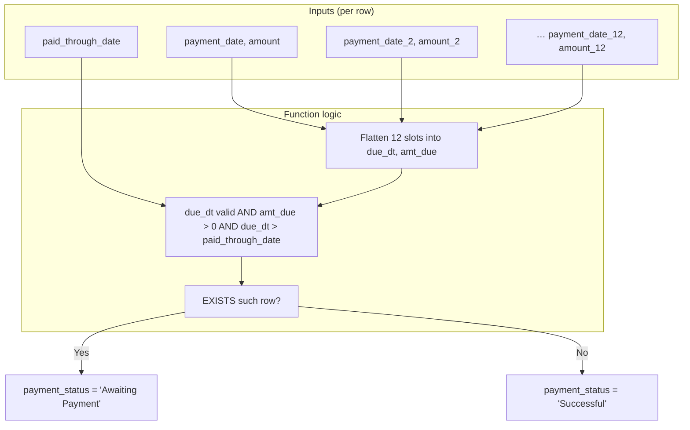

# Payment Success Tracker

Documentation for the `payment_success_tracker` table and its automated payment-status logic in Supabase/PostgreSQL.

---

## Overview

`payment_success_tracker` stores membership and payment-plan records. It supports **up to 12 installments** per record (`payment_date` / `amount` through `payment_date_12` / `amount_12`). A trigger keeps `payment_status` in sync when **`paid_through_date`** is updated: if there are still future installments with amount &gt; 0 after that date, status stays **Awaiting Payment**; otherwise it becomes **Successful**.

---

## Table Schema

| Column | Type | Nullable | Default | Description |
|--------|------|----------|---------|-------------|
| `id` | uuid | NO | `gen_random_uuid()` | Primary key |
| `member_id` | uuid | NO | — | Reference to member |
| `membership_type_id` | uuid | YES | — | Reference to membership type |
| `payment_date` | text | YES | — | First installment date (YYYY-MM-DD) |
| `amount` | numeric | NO | — | First installment amount |
| `payment_date_2` … `payment_date_12` | text | YES | — | Installment dates 2–12 |
| `amount_2` … `amount_12` | numeric | YES | — | Installment amounts 2–12 |
| `payment_status` | text | NO | `'Awaiting payment'` | **Auto-updated by trigger** when `paid_through_date` changes |
| `payment_method` | text | NO | — | How the payment was made |
| `sale_type` | text | YES | — | Type of sale |
| `product_description` | text | YES | — | Product/service description |
| `payment_plan_label` | text | YES | — | Label for the plan |
| `price_agreed` | numeric | YES | — | Agreed total price |
| `start_date` | date | YES | — | Plan start |
| `end_date` | date | YES | — | Plan end |
| **`paid_through_date`** | date | YES | — | **Trigger key:** date through which payments are considered paid |
| `paid_through_updated_at` | timestamptz | YES | `now()` | When `paid_through_date` was last updated |
| `gym` | text | YES | — | Gym/location |
| `member_firstname` | text | YES | — | Member first name |
| `member_lastname` | text | YES | — | Member last name |
| `notes` | text | YES | — | Free-form notes |
| `created_at` | timestamptz | NO | `now()` | Row creation time |

---

## Trigger & Function

### Trigger

| Property | Value |
|----------|--------|
| **Name** | `trg_set_payment_status_from_paid_through` |
| **Table** | `public.payment_success_tracker` |
| **When** | `BEFORE UPDATE OF paid_through_date` |
| **Per** | `FOR EACH ROW` |
| **Function** | `public.set_payment_status_from_paid_through()` |

The trigger runs **only** when a row is updated **and** the updated column is `paid_through_date`. It does not run on INSERT or on updates to other columns.

### Function: `set_payment_status_from_paid_through()`

**Purpose:** Set `payment_status` to **Awaiting Payment** or **Successful** based on `paid_through_date` and the schedule of installments (slots 1–12).

**Rules:**

1. **Closed statuses are never changed:** If `payment_status` is (case-insensitive) `refunded`, `cancelled`, or `no sale`, the function returns `NEW` unchanged.
2. **No `paid_through_date`:** If `paid_through_date` is NULL, the function returns `NEW` unchanged.
3. **Future installments:** The function treats `payment_date`/`amount` through `payment_date_12`/`amount_12` as installments. Only text values matching `YYYY-MM-DD` are cast to date. It checks whether **any** installment has:
   - A valid due date (after `paid_through_date`)
   - Amount &gt; 0 (NULL treated as 0)
4. **Result:**
   - If such a future due exists → `payment_status` = **`Awaiting Payment`**
   - Otherwise → `payment_status` = **`Successful`**

---

## Process Flow (Mermaid)

### High-level: table, trigger, and status outcome

### Detailed: function decision logic

### Data flow: installments and paid_through_date

---

## Summary

- **Table:** `payment_success_tracker` — membership/payment plan rows with up to 12 installments.
- **Trigger:** Fires only on **UPDATE OF paid_through_date**; calls `set_payment_status_from_paid_through()`.
- **Function:** Leaves closed statuses and NULL `paid_through_date` alone; otherwise sets `payment_status` to **Awaiting Payment** (future dues with amount &gt; 0) or **Successful** (none).

Use this README and the Mermaid diagrams to reason about or document the full process and function of this table in GitHub or elsewhere.
# Payment-Success-Tracker
